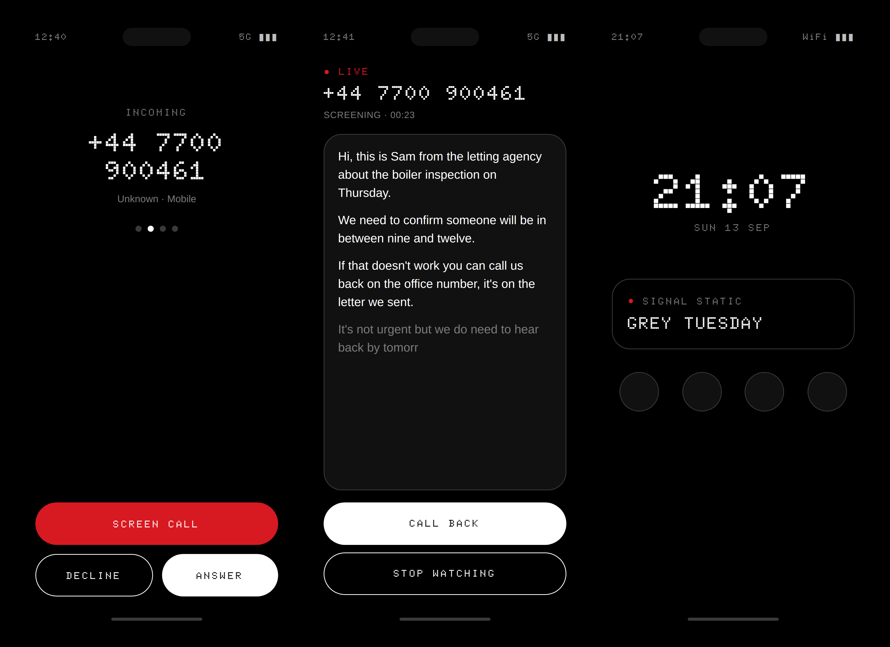

# Nothing Suite

Open-source, community-built software for Nothing Phone owners. Privacy-first,
zero hosting cost: every cloud feature runs on keys **you** supply (BYOK).



*Design previews rendered from the app's own design tokens; on-device screenshots to follow.*

```
nothing-suite/
├── README.md
├── LICENSE                          MIT
├── docs/
│   ├── architecture.md              How the pieces talk to each other
│   ├── carrier-forwarding.md        The *61* (no-answer) forwarding that makes screening work
│   ├── google-play.md               Selling to Nothing phones only, products, permissions review
│   ├── shade-guard.md               Anti-theft Quick Settings lock — how it works and its limits
│   ├── now-playing.md               Ambient music widget — sampling loop, costs, Play notes
│   ├── roadmap.md                   12-month, 11-app portfolio plan with sizing
│   └── dot-widgets.md               Roadmap #1 — design notes and Play listing copy
├── backend-server/                  Telephony engine (Node 20 + Express + ws). Runs on YOUR machine.
│   ├── package.json
│   ├── requirements.txt             Python deps for the free local transcriber
│   ├── whisper_worker.py            faster-whisper worker (runs on your machine, no key)
│   ├── .env.example
│   └── src/
│       ├── index.js                 Boot: HTTP + two WebSocket endpoints (/twilio-media, /app)
│       ├── config.js                Env loading + validation (TRANSCRIBER=local|openai)
│       ├── twilio/
│       │   ├── voiceWebhook.js      POST /voice  → TwiML that opens a Media Stream
│       │   └── mediaStream.js       Twilio Media Streams (μ-law 8 kHz) → transcriber
│       ├── transcribers/
│       │   ├── index.js             Picks the transcriber from .env
│       │   ├── localWhisperTranscriber.js   FREE: μ-law → PCM → voice detector → whisper_worker.py
│       │   └── openaiTranscriber.js         PAID: OpenAI Realtime transcription (BYOK)
│       └── app/
│           └── appSocket.js         Authenticated WS the phone subscribes to for live text
└── android-app/                     Gradle multi-module Android project — THREE apps, one design system
    ├── settings.gradle.kts
    ├── build.gradle.kts
    ├── gradle.properties
    ├── glyph-sdk/                   Drop the official Glyph SDK .aar here (not redistributed)
    ├── core-billing/                :core-billing — Google Play one-time unlock, shared by every paid app
    ├── core-design/                 :core-design — Nothing OS design system (Jetpack Compose) + bundled Doto font
    │   └── src/main/java/uk/nothingsuite/design/
    │       ├── NothingTheme.kt      Theme entry point + LocalNothingHaptics
    │       ├── NothingColors.kt     Monochrome + Nothing red palette, light/dark
    │       ├── NothingType.kt       Dot-matrix display face + grotesk body face
    │       ├── NothingShapes.kt     Geometric borders, hairlines, pill radius
    │       ├── NothingHaptics.kt    Custom click/tick/confirm haptic patterns
    │       └── components/
    │           ├── NothingButton.kt
    │           ├── NothingCard.kt
    │           ├── DotMatrixText.kt
    │           └── NothingLoader.kt Dot-matrix loading state
    └── app/                         :app — the dialer + screener + Glyph tracker
        ├── build.gradle.kts
        └── src/main/
            ├── AndroidManifest.xml  Default-dialer manifest (InCallService, ROLE_DIALER, listeners)
            ├── res/values/strings.xml
            ├── res/xml/network_security_config.xml
            └── java/uk/nothingsuite/app/
                ├── NothingSuiteApp.kt        Application + DI-lite singletons
                ├── MainActivity.kt           Home / setup / role request
                ├── telecom/
                │   ├── ScreenerInCallService.kt   InCallService — receives Call objects
                │   ├── CallRepository.kt          Observable current-call state
                │   ├── DialerRoleManager.kt       RoleManager.ROLE_DIALER request flow
                │   ├── IncomingCallActivity.kt    Full-screen incoming UI with "Screen Call"
                │   └── ScreenCallAction.kt        silence() + hand-off to transcript screen
                ├── transcript/
                │   ├── TranscriptSocketClient.kt  OkHttp WS client → backend /app
                │   ├── TranscriptViewModel.kt
                │   └── LiveTranscriptActivity.kt  Auto-scrolling live transcript
                ├── settings/
                │   ├── SecureSettings.kt          EncryptedSharedPreferences for BYOK keys
                │   └── SettingsActivity.kt
                ├── glyph/
                │   ├── GlyphController.kt         Glyph Developer Kit wrapper
                │   ├── GlyphProgressListener.kt   NotificationListenerService routing loop
                │   ├── ProgressExtractors.kt      Per-app parsers (delivery, transit, generic %)
                │   └── GlyphAnimations.kt         Free vs premium visualiser animations
                └── (billing lives in :core-billing)
    ├── anti-theft-module/           :anti-theft-module — "Shade Guard" (separate app, uk.nothingsuite.shadeguard)
    │   ├── build.gradle.kts
    │   └── src/main/
    │       ├── AndroidManifest.xml            Accessibility service + biometric gate activity
    │       ├── res/xml/accessibility_service_config.xml   System UI window events only, no content access
    │       └── java/uk/nothingsuite/shadeguard/
    │           ├── ShadeGuardAccessibilityService.kt  Shade opened while locked → dismiss → gate
    │           ├── BiometricGateActivity.kt           BiometricPrompt over the lock screen, 45 s grace
    │           ├── GuardState.kt                      Enabled flag, grace window, last event
    │           └── MainActivity.kt                    Setup screen
    ├── dot-widgets/                 :dot-widgets — "Dot Widgets" for ANY Android phone (roadmap #1, uk.nothingsuite.dotwidgets)
    │   └── src/main/
    │       ├── AndroidManifest.xml            Six widget receivers, two config activities; only VIBRATE (haptics)
    │       ├── res/layout/widget_*.xml        RemoteViews layouts using the bundled dot-matrix font
    │       └── java/uk/nothingsuite/dotwidgets/
    │           ├── widgets/DotWidget.kt           Base class: paywall state, tap-to-open, refresh
    │           ├── widgets/Widgets.kt             Clock, Date, Battery (free) · Progress, Countdown, Label (£2.99)
    │           ├── config/WidgetConfigActivity.kt Countdown + Label setup screens
    │           └── MainActivity.kt                Gallery + unlock
    └── music-tracker-module/        :music-tracker-module — "Now Playing" (separate app, uk.nothingsuite.nowplaying)
        ├── build.gradle.kts
        └── src/main/
            ├── AndroidManifest.xml            Microphone foreground service + Glance widget receiver
            ├── res/xml/now_playing_widget_info.xml
            └── java/uk/nothingsuite/nowplaying/
                ├── NowPlayingApp.kt
                ├── MainActivity.kt                    BYOK setup + Play-style microphone disclosure
                ├── BootReceiver.kt
                ├── audio/
                │   ├── AudioSampler.kt                5 s PCM clip + loudness (RMS) + WAV wrapper
                │   └── AmbientListenerService.kt      Foreground loop: sample → gate → recognise → widget
                ├── recognition/
                │   ├── RecognitionSettings.kt         Encrypted ACRCloud key/host, interval, gate
                │   └── AcrCloudClient.kt              HTTPS identify with HMAC-SHA1 signature; Recognizer interface
                └── widget/
                    ├── NowPlayingWidget.kt            Jetpack Glance widget, black card, red live dot
                    ├── DotMatrixBitmap.kt             Renders dot-matrix text to bitmaps (widgets can't load fonts)
                    └── NowPlayingState.kt
```

## The suite

Three installable apps that share one design system. They are separate on
purpose: each carries only the permissions it needs, so the dialer's Google
Play review isn't burdened by a microphone it doesn't use, and a rejection
of one (Shade Guard is the risky one) doesn't block the others.

| App | Module | What it does | Cloud cost to you |
|---|---|---|---|
| **Nothing Suite** (dialer) | `:app` | AI call screener: tap Screen, the call rings out to your screener number, watch a live transcript. Plus the Universal Glyph Progress Tracker for deliveries/transit | A phone number (~£1/month + ~1p/min). Speech-to-text free with the local option |
| **Shade Guard** | `:anti-theft-module` | Fingerprint before Quick Settings opens while the phone is locked, so a thief can't flick on flight mode | none |
| **Dot Widgets** | `:dot-widgets` | Dot-matrix clock, date, battery, progress, countdown and label widgets for any Android phone — no KWGT | none |
| **Now Playing** | `:music-tracker-module` | Dot-matrix widget naming the music playing around you, sampled every few minutes | Your own recognition-service key (ACRCloud etc.) |
| *(library)* | `:core-design` | Compose design system: monochrome + red, dot-matrix type, custom haptics | none |

## Quick start (backend)

```bash
cd backend-server
cp .env.example .env               # fill in TWILIO_*, APP_SHARED_SECRET; TRANSCRIBER=local is the default
npm install
pip install -r requirements.txt    # only for the free local transcriber (skip if TRANSCRIBER=openai)
npm start                          # http://localhost:8080 — first run downloads the ~150 MB speech model
# expose it: ngrok http 8080   (or a Cloudflare Tunnel — both have free tiers)
```

Local transcription needs a machine from roughly the last five years; a
Raspberry Pi 5 copes with `tiny.en`, a laptop is comfortable with `base.en`.

Point your Twilio number's *Voice → A call comes in* webhook at
`https://<your-tunnel>/voice`. In the phone app, enter
`wss://<your-tunnel>/app` and the same `APP_SHARED_SECRET`.

## Quick start (Android)

1. Download the Glyph Developer Kit `.aar` from Nothing's GitHub and drop it in `android-app/glyph-sdk/`.
2. Open `android-app/` in Android Studio, run on a Nothing Phone (1/2/2a/3a/3).
3. Accept the "Set as default phone app" prompt, then grant Notification Access for the Glyph tracker.
4. In Setup, tap the two "Forward" buttons once each (see `docs/carrier-forwarding.md`).

## Honest caveats, up front

* **Screening goes through your mobile network.** No Android app can move a live call itself. The app silences the ring and your network's "forward when no answer" rule (5 s) diverts the caller to the screener — the same mechanism as voicemail, supported by every UK network. The caller hears ~5 s of extra ringing. The diverted leg counts as an outgoing call: free with inclusive minutes, a standard call charge on pay-as-you-go.
* **The phone number is the one unavoidable cost.** Roughly £1/month plus about 1p/min inbound from Twilio (Telnyx, SignalWire and Vonage are similar). UK numbers need a one-off address/regulatory check. Speech-to-text is free with `TRANSCRIBER=local`.
* **Premium unlock sells through Google Play Billing** (15 % cut). The signed-licence-file path remains for your own testing and any future non-Play build; it is never used for Play sales. See `docs/google-play.md` for restricting the listing to Nothing phones.
* **Shade Guard is experimental.** The overlay approach in the original brief can't work on modern Android (overlays sit under the status bar and vanish on the lock screen), so it's an accessibility service that closes the shade and asks for a fingerprint. That leaves a ~100 ms gap, doesn't cover power-off, overlaps with Android 15's built-in theft protections, and may not pass Google Play's accessibility-service policy. Details in `docs/shade-guard.md`.
* **Now Playing shows the mic indicator every time it listens.** Background microphone use requires a foreground service with a visible notification; WorkManager can't record on Android 11+. It also needs the user's own recognition key. Details in `docs/now-playing.md`.
* **Fonts.** Doto (OFL) is bundled as the dot-matrix face. Nothing's NDot is proprietary and is never committed; see `core-design/fonts-licence/README.md`.
